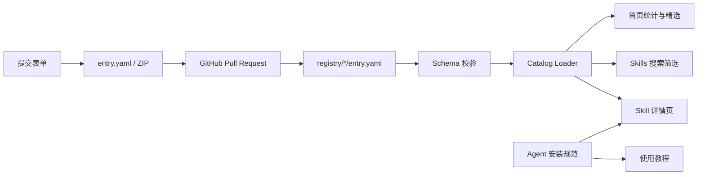

# 仓颉 Skill 官网重设计方案

## 目标

把当前“功能完整但视觉普通”的 Astro 官网升级为一个同时具备品牌记忆点、Skill 发现效率、Agent 安装闭环和公开投稿闭环的正式产品站。

正式实现以 `cangjie-skill-2.0` 为唯一代码与数据来源。独立的 `cangjie-skill-site` 只作为“蒸馏列车”视觉和动效原型，不再维护第二份 Registry。

## 产品架构

约束：

- `registry/{slug}/entry.yaml` 是唯一 Skill 数据源。
- `schemas/registry-entry.schema.json` 是唯一结构规范。
- 安装提示词固定使用 `https://kangarooking.github.io/cangjie-skill/install/cangjie-skill.md`。
- 不新增账号、数据库、评分、评论或在线执行 Skill。
- 本地投稿文件只在浏览器内读取、检查和打包。

## 视觉概念：温暖的 3D 动画电影世界

2026-07-26 根据视觉评审更新：整站不再采用“编辑设计 + 工业档案 + 东方纸本”，而是与“蒸馏列车”主视觉统一成明亮、圆润、有角色感的 3D 动画电影语言。

- 主色：天空蓝 `#75c9f5` 与深海蓝 `#183856`。
- 底色：奶油白 `#f7fcff` 与浅天空蓝 `#dff5ff`。
- 强调：暖橙 `#f66b3b` 与阳光黄 `#ffc857`。
- 辅助：青草绿 `#63c98a`、莓果紫 `#9a76d8`。
- 展示字体：圆润、厚重、具有亲和力的无衬线标题字体。
- 组件语言：大圆角、柔和高光、多层阴影、玩具块与气泡形态。
- 元数据：继续使用等宽字体，但收进胶囊标签和轻量面板中。

记忆点仍然是“蒸馏列车”，但它不再是孤立的动画片段。导航头像、按钮、Registry 面板、步骤卡、Skill 卡片、安装台、教程与投稿表单都使用同一套材质、色彩和圆润层级。复杂动画仍集中在首页，其余页面用短促的悬浮、回弹和高光反馈保持节奏。

## 页面设计

### 首页

- 首屏解释“收藏的知识如何成为 Agent 能力”。
- 五段蒸馏旅程保留，但缩短滚动距离，提供跳过入口。
- 首屏之后立即显示动态 Registry 统计。
- 三步使用、精选 Skill、开放投稿构成产品区。
- 所有核心入口在不完成滚动叙事的情况下仍可访问。

### Skills 目录

- 采用“动画工作台 + 玩具卡片”布局，不使用普通 SaaS 卡片墙。
- 搜索框是主视觉控件，筛选器使用紧凑的标签与下拉组合。
- 结果数、当前条件、重置和空状态始终明确。
- 所有条件写入 URL，可复制和恢复。

### Skill 详情

- 左侧是分段方法内容，右侧是固定的深蓝 3D Agent 安装台。
- 安装提示词是最突出动作。
- 质量、状态、来源、语言和版本信息采用可扫描的元数据表。
- 移动端将安装卡提前到正文前。

### 使用教程

- 以连续五步手册呈现。
- 桌面端有粘性目录，移动端保留锚点。
- 安装、调用、验证示例使用独立的“指令纸条”视觉。

### 提交 Skill

- 左侧分段填写，右侧实时预览 Registry YAML。
- GitHub 和本地文件夹两种模式共享有效字段。
- 风险、隐私、敏感文件和审核规则在操作前明确展示。

## 动效与可访问性

- 首页使用一次完整的滚动叙事，不堆叠零碎动画。
- 卡片、按钮和筛选只使用短促的位移、边框和颜色反馈。
- `prefers-reduced-motion` 下禁用滚动同步视频和大幅位移。
- 全站支持键盘操作、可见焦点、ARIA 状态和跳到正文。
- 对比度达到 WCAG 2.1 AA 基础要求。

## 交付边界

首轮交付包含 PRD 全部 P0，以及 P1 中的 URL 筛选、Clipboard 回退、投稿草稿、兼容提示、SEO、可访问性和部署健康检查。

首轮不包含账号、数据库、收藏、评论、评分、排行榜、趋势和贡献者主页。
